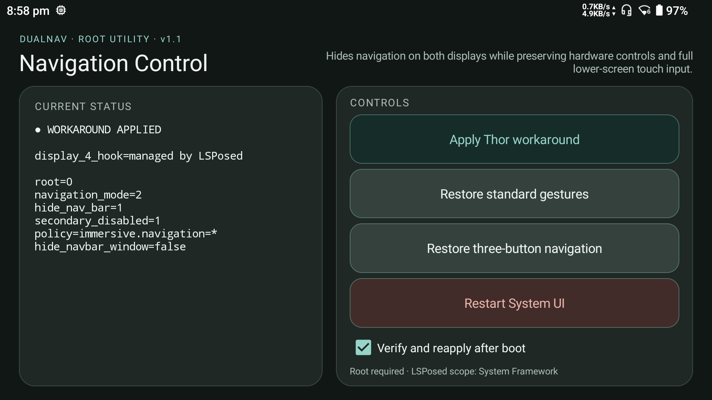

# DualNav Control

An unofficial, root-enabled Android utility for fixing persistent navigation
UI on the dual-screen AYN Thor. It has been tested on the February 2026
Android 13 firmware.

> **Unofficial project:** DualNav Control is an independent community utility.
> It is not developed, sponsored, endorsed, or supported by Shenzhen AYN
> Technologies Co., Ltd. AYN and Thor are used only to identify the compatible
> device. All related trademarks belong to their respective owners.



## What it does

- **Apply Thor workaround:** hides persistent navigation UI while retaining
  hardware-button navigation.
- **Block the lower-screen reveal gesture:** an LSPosed framework hook prevents
  the display 4 bottom swipe from revealing `NavigationBar4`.
- **Suppress recreated lower navigation windows:** while the workaround is
  enabled, the framework hook also hides `NavigationBar4` if SystemUI recreates
  it during transitions between ordinary non-fullscreen apps.
- **Restore standard gestures:** removes the workaround and restores Android
  gesture navigation.
- **Restore three-button navigation:** removes the workaround and restores
  Android Back, Home, and Recents buttons.
- **Restart System UI:** clears a stuck navigation layer without rebooting.
- **Verify and reapply after boot:** optional and disabled by default.

The apply and boot actions are hard-blocked unless Android identifies the
device as an AYN Thor and reports at least two displays. Restore controls remain
available on unsupported or single-screen devices.

## Requirements

- AYN Thor running the compatible Android 13 firmware
- Magisk root
- Zygisk enabled
- LSPosed with DualNav Control enabled and scoped to **System Framework**

This is a device-specific system modification. Back up anything important and
use the restore controls if the navigation setup becomes unsuitable.

The app displays an unsupported-device warning when the detected hardware is
not an AYN Thor with a secondary display. The Thor-specific Apply action remains
blocked on unsupported devices. Results may vary across firmware versions, and
the software is provided without warranty. You use root-level modifications at
your own risk.

## Installation

1. Download the APK from the latest GitHub release.
2. Install it as a normal Android APK.
3. Open LSPosed, enable **DualNav Control**, and scope it only to
   **System Framework**.
4. Reboot.
5. Open DualNav Control and choose **Apply Thor workaround**.
6. Approve the Magisk root prompt.

## Building

The project requires JDK 17 and Android SDK 35.

```bash
./gradlew :app:assembleRelease
```

The Xposed API 82 JAR is a compile-only dependency and is not packaged into the
APK. Its provenance is recorded in [THIRD_PARTY_NOTICES.md](THIRD_PARTY_NOTICES.md).

## Support scope

This workaround depends on AYN's Android framework behavior and the lower
display being exposed as display ID 4. Future firmware may change those
internals. Please include the device firmware version, LSPosed version, and a
description of the visible navigation behavior when reporting a problem.

## Development disclosure

This project was created under human direction with assistance from OpenAI
Codex. AI assistance was used for portions of the code, documentation, build
automation, and test workflow. The device-specific behavior and release APK
were reviewed and tested by the project owner on real AYN Thor hardware.

AI-assisted output can contain mistakes. Review the source and understand the
root/LSPosed changes before installing or modifying the project.

## Changelog

### v1.1

- Fixed the lower navigation bar reappearing during transitions between
  non-fullscreen apps.
- The LSPosed hook now suppresses newly laid-out `NavigationBar4` windows while
  the workaround is active.
- Restore operations remain available and the primary display is unaffected.

## License

DualNav Control's original source and icon are available under the
[MIT License](LICENSE). Third-party components retain their own licenses.
